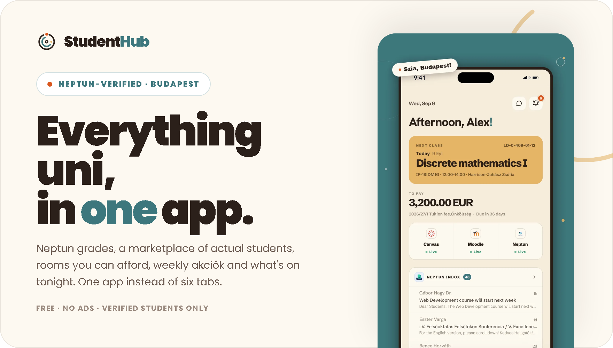
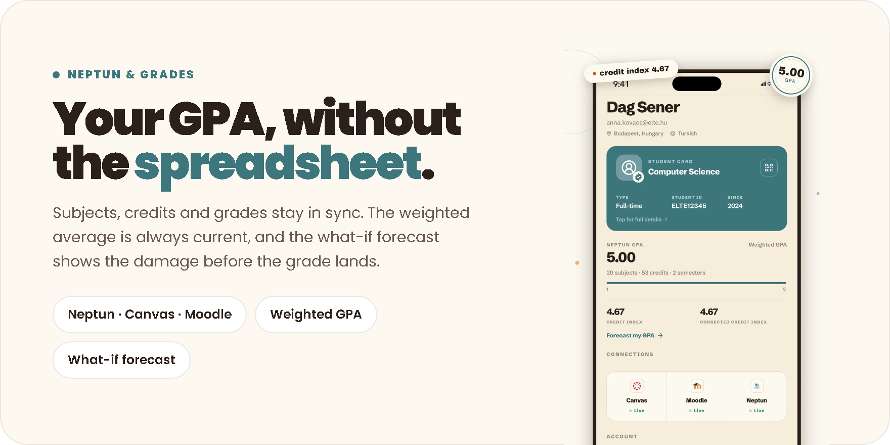
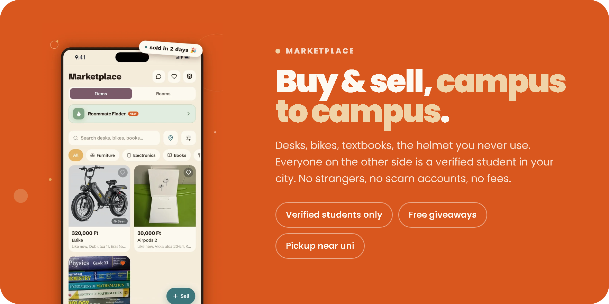
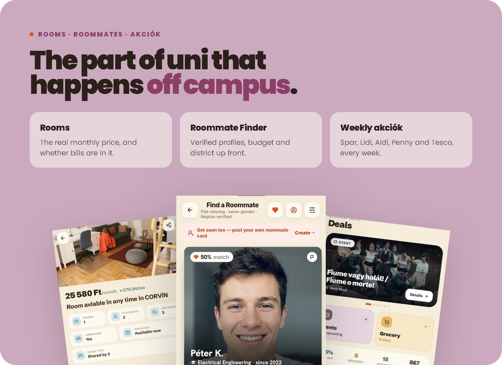
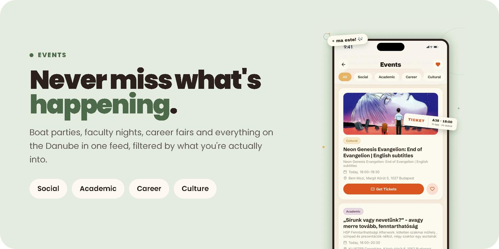
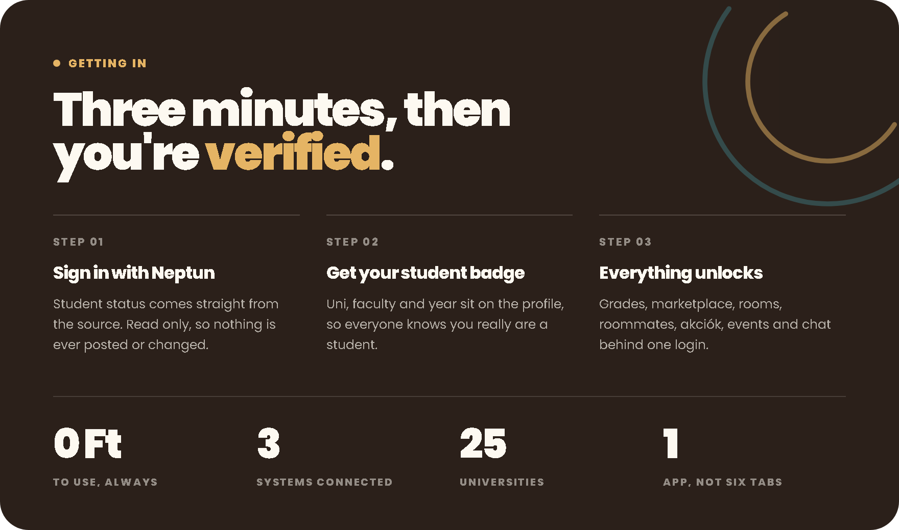
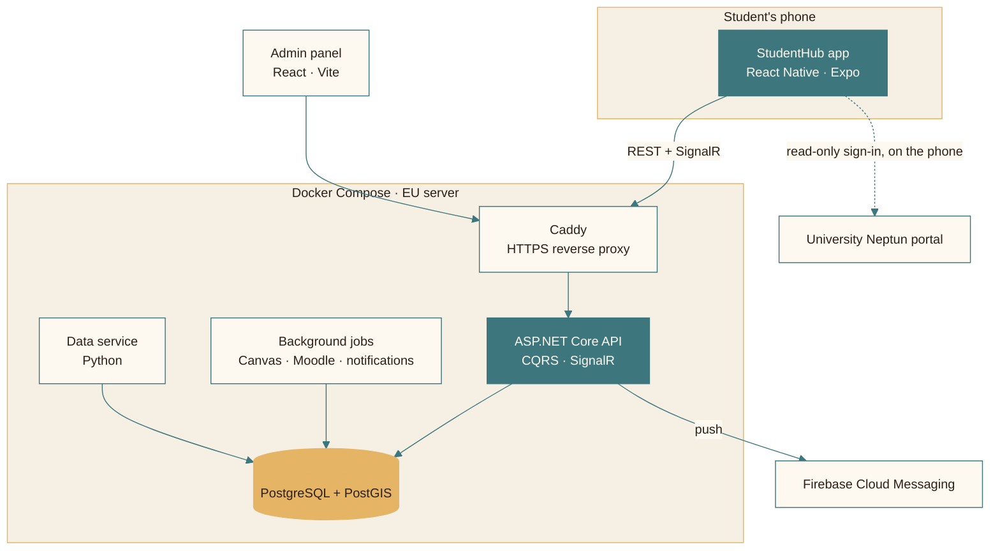
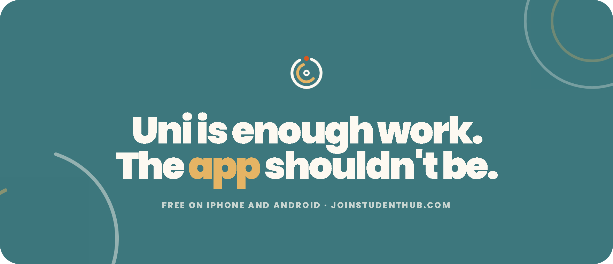

<a href="https://joinstudenthub.com">
  <picture>
    <source media="(prefers-color-scheme: dark)" srcset="assets/boards/hero-dark.png" />
    
  </picture>
</a>

  
  &nbsp;
  

  <a href="https://joinstudenthub.com"><b>joinstudenthub.com</b></a>
  &nbsp;·&nbsp;
  <a href="https://joinstudenthub.com/hu">Magyar oldal</a>
  &nbsp;·&nbsp;
  <a href="https://joinstudenthub.com/privacy.html">Privacy</a>
  &nbsp;·&nbsp;
  <a href="https://joinstudenthub.com/terms.html">Terms</a>
  &nbsp;·&nbsp;
  <a href="mailto:support@joinstudenthub.com">Contact</a>

  
    <a href="#features">Features</a> ·
    <a href="#how-it-works">How it works</a> ·
    <a href="#supported-universities">Universities</a> ·
    <a href="#faq">FAQ</a> ·
    <a href="#magyarul">Magyarul</a> ·
    <a href="#under-the-hood">Under the hood</a> ·
    <a href="#tech-stack">Tech stack</a> ·
    <a href="#team">Team</a>
  

 

**StudentHub** is a free mobile app for university students in Hungary, built in Budapest. It links a student's **Neptun** account (read only) to keep subjects, credits and grades in sync with a **weighted GPA calculator and what-if forecast**, and it verifies that every user is a real student. On top of that it covers the parts of student life that happen off campus: a **marketplace** of verified students, **rooms and flatshares**, a **roommate finder**, **weekly grocery deals (akciók)** from Spar, Lidl, Aldi, Penny and Tesco, **student events in Budapest** and **chat**.

It works at 25 Hungarian universities, including ELTE, BME, Corvinus, Semmelweis, Óbuda, Szeged, Debrecen and Pécs. Available on iPhone and Android, in English and Hungarian, with no ads and no fees.

## The problem

A student in Budapest runs their university life across half a dozen places. Grades live in Neptun, which logs you out every few minutes and has no idea what your average will be after the next exam. The GPA forecast lives in a spreadsheet. Flats, flatmates and second-hand desks live in Facebook groups, where anyone can post and scams are routine. Grocery deals are split across five supermarket flyers, and events are scattered over pages nobody follows.

For international students, who arrive without a local network or much Hungarian, every one of those places is harder. StudentHub puts them in one app and makes sure everyone in it is a real student.

## Features

<table>
  <tr>
    <td width="50%" valign="top">&nbsp;&nbsp;<b>Neptun sync and GPA</b> Grades, credits, weighted average and a what-if forecast.</td>
    <td width="50%" valign="top">&nbsp;&nbsp;<b>Timetable and reminders</b> Your week from Neptun, with offline class reminders.</td>
  </tr>
  <tr>
    <td valign="top">&nbsp;&nbsp;<b>Marketplace</b> Buy, sell and give away between verified students.</td>
    <td valign="top">&nbsp;&nbsp;<b>Rooms</b> Real monthly price, and whether bills are included.</td>
  </tr>
  <tr>
    <td valign="top">&nbsp;&nbsp;<b>Roommate finder</b> Match score, budget and district up front.</td>
    <td valign="top">&nbsp;&nbsp;<b>Weekly akciók</b> Grocery deals from five chains, every week.</td>
  </tr>
  <tr>
    <td valign="top">&nbsp;&nbsp;<b>Events</b> Parties, faculty nights, career fairs and culture.</td>
    <td valign="top">&nbsp;&nbsp;<b>Chat</b> Real-time messages between verified students.</td>
  </tr>
</table>

### Neptun grades and a GPA calculator

Link Neptun once and subjects, credits and grades arrive on their own. The weighted average (súlyozott átlag), the credit index and the corrected credit index are always current, and the what-if forecast shows how the next grade will move them before it lands. Canvas and Moodle can be linked alongside Neptun, so every course and grade ends up in the same place.

### A student marketplace with no strangers

Desks, bikes, textbooks, the helmet you never use. Everyone on the other side is a verified student in the same city, so there are no anonymous sellers, no scam accounts and no commission on the deal. Free giveaways are welcome, and pickup is usually a walk from campus.

### Rooms, roommates and weekly grocery deals

- **Rooms:** student-posted listings in Budapest that state the real monthly price in forints and whether bills are included.
- **Roommate finder:** swipeable cards with a match score, budget and preferred district. Same-gender matching and Neptun-verified profiles only.
- **Weekly akciók:** deals from Spar, Lidl, Aldi, Penny and Tesco, refreshed every week and filtered by chain.

### Student events in Budapest

Boat parties, faculty nights, career fairs, cinema and everything on the Danube in one feed, filtered by what you are actually into: social, academic, career or culture.

### And the everyday things

- **Timetable:** the week comes straight from Neptun's calendar export and keeps working without a signal.
- **Class reminders:** scheduled on the phone itself, so they fire offline and on time.
- **Home screen widgets:** the next class, today's classes and the week's schedule, right on the home screen of iPhone and Android.
- **Chat:** real-time direct messages between verified students, with blocking and reporting built in.
- **Two languages:** the whole app is available in English and Hungarian.

## How it works

1. **Sign in with Neptun.** The student signs in on their university's own Neptun page, inside the app. The connection is read only: StudentHub never posts or changes anything.
2. **Get the student badge.** University, faculty and year appear on the profile, so everyone you deal with knows you really are a student.
3. **Everything unlocks.** Grades, marketplace, rooms, roommates, akciók, events and chat all sit behind the same login.

## Supported universities

Grades, the GPA forecast and chat work at every university below. Rooms, akciók and events start in Budapest and roll out city by city, with Szeged, Debrecen and Pécs next.

<b>All 25 universities</b>

 

| University | City |
| --- | --- |
| Eötvös Loránd University (ELTE) | Budapest |
| Budapest University of Technology and Economics (BME) | Budapest |
| Corvinus University of Budapest | Budapest |
| Semmelweis University | Budapest |
| Óbuda University | Budapest |
| Budapest University of Economics and Business (BGE) | Budapest |
| Budapest Metropolitan University (METU) | Budapest |
| Pázmány Péter Catholic University | Budapest |
| Károli Gáspár University of the Reformed Church | Budapest |
| Ludovika University of Public Service | Budapest |
| Hungarian University of Sports Science | Budapest |
| Liszt Ferenc Academy of Music | Budapest |
| Moholy-Nagy University of Art and Design (MOME) | Budapest |
| University of Veterinary Medicine Budapest | Budapest |
| IBS International Business School | Budapest |
| University of Szeged | Szeged |
| University of Debrecen | Debrecen |
| University of Pécs | Pécs |
| Széchenyi István University | Győr |
| University of Pannonia | Veszprém |
| University of Miskolc | Miskolc |
| Hungarian University of Agriculture and Life Sciences (MATE) | Gödöllő |
| John von Neumann University | Kecskemét |
| Eszterházy Károly Catholic University | Eger |
| University of Nyíregyháza | Nyíregyháza |

## FAQ

<b>Is my Neptun login safe?</b>

 
The connection is read only, and the Neptun password stays encrypted on your own phone, in the iOS Keychain or Android Keystore. It is never sent to StudentHub's servers. StudentHub reads your subjects and grades and never writes anything back.

<b>Which universities work?</b>

 
Any of the <a href="#supported-universities">25 Hungarian universities</a> that run the current Neptun web portal, including ELTE, BME, Corvinus, Semmelweis, Szeged, Debrecen and Pécs. Canvas and Moodle can be linked on top.

<b>What does StudentHub cost?</b>

 
Nothing. No subscription, no ads in the feed and no commission on marketplace deals, so you keep the full 30,000 Ft for the AirPods.

<b>I'm not in Budapest. Is it still useful?</b>

 
Yes. Grades, the GPA forecast, the timetable and chat work anywhere. Rooms, akciók and events start in Budapest and roll out city by city.

<b>Is this an official Neptun app?</b>

 
No. StudentHub is an independent student project. It is not affiliated with, endorsed by or operated by Neptun, SDA Informatika, Instructure (Canvas), Moodle or any university.

<b>I'm an international student. Is the app in English?</b>

 
Yes. The whole app works in English and in Hungarian, and it was built with international students in Budapest in mind.

<b>How do I delete my data?</b>

 
Listings, roommate cards and profile details can be deleted in the app at any time, and anything else on request. The steps are at <a href="https://joinstudenthub.com/delete-data.html">joinstudenthub.com/delete-data.html</a>.

## Magyarul

**StudentHub: az egyetemi élet, egy appban.** Ingyenes mobilalkalmazás magyarországi egyetemistáknak. Neptun-jegyek, igazi egyetemisták piactere, megfizethető albérletek, heti akciók és a ma esti programok. Egy app hat böngészőfül helyett.

- **Neptun és jegyek:** kösd össze egyszer a fiókodat, és a tárgyaid, kreditjeid és jegyeid szinkronban maradnak. A súlyozott átlag mindig naprakész, a mi-lenne-ha előrejelzés pedig megmutatja a kárt, még mielőtt megjön a jegy.
- **Piactér:** íróasztalok, biciklik, tankönyvek. A másik oldalon mindig egy hitelesített egyetemista áll a saját városodból, így nincs átverős fiók és nincs jutalék.
- **Albérletek és lakótárskereső:** valódi havi ár, és az is, hogy benne van-e a rezsi. Azonos nemű párosítás, Neptunnal hitelesített profilok, előre látható keret és kerület.
- **Heti akciók:** Spar, Lidl, Aldi, Penny és Tesco akciók, hetente frissítve.
- **Események:** hajós bulik, kari estek, állásbörzék és kultúra egyetlen listában.

A kapcsolat csak olvasható, a belépési adataid pedig titkosítva maradnak a saját eszközödön. Ingyenes, reklámmentes, csak hitelesített egyetemistáknak.

[Letöltés az App Store-ból](https://apps.apple.com/app/studenthub-uni-life/id6799090991) · [Letöltés a Google Playen](https://play.google.com/store/apps/details?id=dev.studenthub.app) · [joinstudenthub.com/hu](https://joinstudenthub.com/hu)

## Privacy and trust

- **Read-only Neptun access.** Nothing is ever written back to a student's Neptun account.
- **The password never leaves the phone.** It is stored in the device's own secure keystore, bound to that device.
- **Data kept to a minimum.** Individual grades, Neptun messages and payments stay on the phone. The server keeps only what verification and the profile need.
- **Moderated by default.** Every photo is screened, listing text goes through content rules, and community reports hide a listing without waiting for an admin.
- **Hosted in the EU**, with a full [privacy policy](https://joinstudenthub.com/privacy.html) and [self-service data deletion](https://joinstudenthub.com/delete-data.html).

## Under the hood

A few of the problems that took the most work.

**Neptun without an official API.** Neptun offers no public API for students. The app opens the university's own login page inside the phone, and once the student signs in it reads the same data the portal shows them. The password is kept in the iOS Keychain or Android Keystore, bound to that device, and is never sent to our servers. The server only receives the profile it needs for verification.

**One integration, 25 portals.** Every university runs its own Neptun installation, and they do not all behave the same. Phones report which request shapes worked at their school (never the data, never the address), and a shape is shared with everyone at that school only after several independent students confirm it. When a portal changes, failures demote the old shape and the app finds the new one on its own.

**Offline first where it matters.** The timetable is refreshed from the university's calendar export, and class reminders are scheduled locally, so a student with no signal still gets told where the next lecture is.

**Location-aware content.** Rooms, deals and events carry PostGIS geometry, so lists are sorted and filtered by real distance from the student and their campus.

**A marketplace people can trust.** Every uploaded photo is screened automatically, listing text goes through content rules, and new listings go live after a short automated review. Community reports hide a listing without waiting for an admin.

**Data that stays fresh by itself.** A separate Python service collects grocery deals, student discounts and events on a schedule and writes them straight into the shared database, so the API never waits on a third-party site.

**Accounts and sessions.** Short-lived access tokens with rotating refresh tokens, Sign in with Apple and Google, alerts when an account signs in on a new device, and TOTP on the admin panel.

## Architecture

The backend follows Clean Architecture with CQRS through MediatR: controllers dispatch commands and queries, handlers do the work, validators run on every request, and entities never cross the API boundary. The whole stack runs as one Docker Compose deployment on an EU server.

## Tech stack

  &nbsp;&nbsp;
  &nbsp;&nbsp;
  &nbsp;&nbsp;
  &nbsp;&nbsp;
  &nbsp;&nbsp;
  &nbsp;&nbsp;
  &nbsp;&nbsp;
  &nbsp;&nbsp;
  

| Layer | Technology |
| --- | --- |
| Mobile | React Native 0.81 (New Architecture), Expo SDK 54, Expo Router, TypeScript, TanStack Query, Zustand, Zod, NativeWind, i18next |
| On-device | React Native WebView, Expo Secure Store (Keychain / Keystore), Notifee local notifications |
| Backend | .NET 10, ASP.NET Core, MediatR (CQRS), FluentValidation, Mapster, SignalR |
| Data | PostgreSQL 16, PostGIS 3.4, EF Core 10 with NetTopologySuite |
| Auth | JWT with rotating refresh tokens, BCrypt, Sign in with Apple, Google Sign-In, TOTP |
| Data service | Python, Scrapling (headless Chromium), SQLAlchemy, APScheduler |
| Admin panel | React 18, Vite, TanStack Table, Recharts, Radix UI |
| Integrations | Neptun, Canvas LMS, Moodle, Firebase Cloud Messaging, Crashlytics, Resend, Sightengine, DeepL |
| Infrastructure | Docker Compose, Caddy with automatic HTTPS, EAS Build |

## Team

StudentHub was designed, built and shipped by two people, working on every part of it together: the mobile app, the backend, the data service, the design and the App Store and Google Play releases.

<table>
  <tr>
    <td align="center" width="200">
       
      <b>Şener Dag</b> 
      Co-founder · Full-stack engineer 
      <a href="https://github.com/senerdag">GitHub</a> · <a href="https://www.linkedin.com/in/senerdag/">LinkedIn</a>
    </td>
    <td align="center" width="200">
       
      <b>Ysmayyl Mammetgeldiyev</b> 
      Co-founder · Full-stack engineer 
      <a href="https://github.com/smile-web-tech">GitHub</a> · <a href="https://www.linkedin.com/in/ysmayyldev/">LinkedIn</a>
    </td>
  </tr>
</table>

 

  
  &nbsp;
  

## About this repository

This repository is the public home of StudentHub. The application source code is private. We are happy to walk through the code and the architecture in an interview; reach out on LinkedIn or at [support@joinstudenthub.com](mailto:support@joinstudenthub.com).

---

StudentHub is an independent student project. It is not affiliated with, endorsed by or operated by Neptun, SDA Informatika, Instructure (Canvas), Moodle or any university. App Store is a service mark of Apple Inc. Google Play is a trademark of Google LLC. © 2026 StudentHub. All rights reserved.
